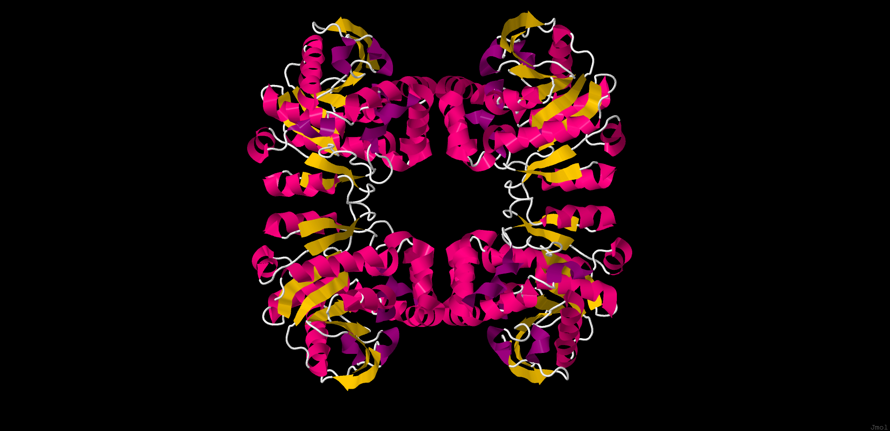
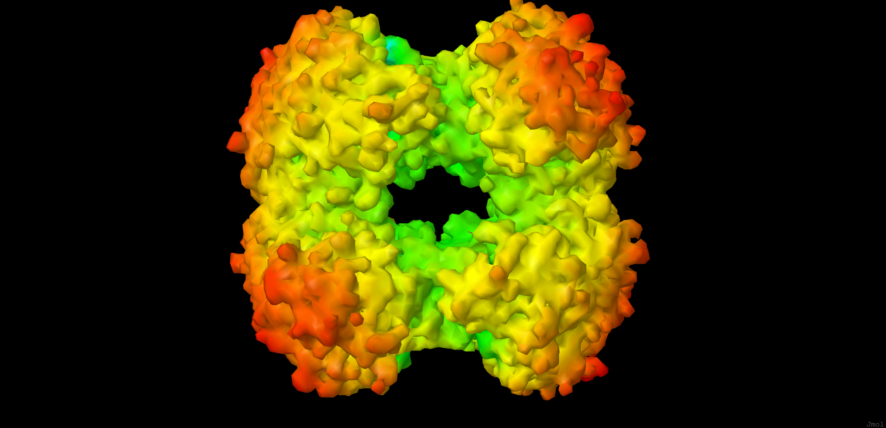
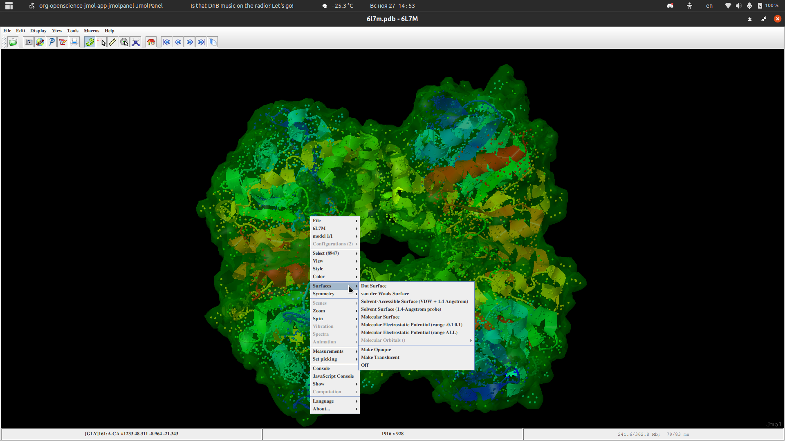

# Homework 5

ПО: Jmol

Ссылка на выбранный белок: https://www.rcsb.org/structure/6L7M

# Режимы визуализации

### Wireframe

### Backbone

### Spacefill

### Ribbons

### Molecular surface

# Раскраски

### CPK

### Domains (chains)

# Изображение публикационного качества

# Как делал??

### Выбор режима визуализации
Right click -> Style -> Scheme -> %something%

### Отрисовка molecular surface
Right click -> Surfaces -> Molecular Surface

Можно сделать прозрачной, нажав на "Make Translucent"

### Выбор режима раскраски
Right click -> Color -> By Scheme -> %something%
